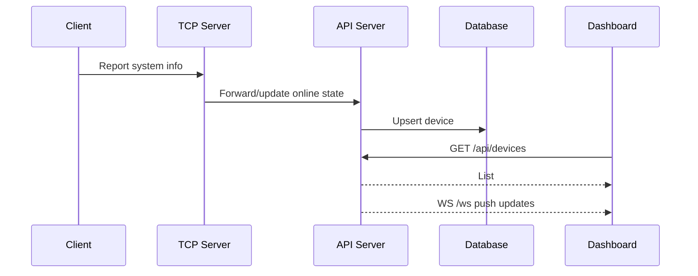

# Net Manager API Documentation

## Base URL

```
http://localhost:8000
```

## Health & Index

- `GET /health`, `GET /healthz` → returns `{"status":"healthy"}`
- `GET /` → redirects to dashboard (after build)

## Devices

- `GET /api/devices` → list with online status
- `GET /api/devices/{device_id}` → details
- `POST /api/devices/create` → create
- `POST /api/devices/update` → update
- `POST /api/devices/delete` → delete
- `PUT /api/devices/{device_id}/type` → update type

Example:
```json
{
  "status": "success",
  "data": [{"id":"device-123","hostname":"DESKTOP","online":true}],
  "count": 1
}
```

## Switches & SNMP

- `GET /api/switches`, `GET /api/switches/{id}`
- `POST /api/switches/create|update|delete`
- `POST /api/switches/scan` (full) | `POST /api/switches/scan/simple`

Scan request:
```json
{
  "ip":"192.168.1.1","snmp_version":"v3",
  "user":"managev3user","auth_protocol":"sha","auth_key":"***",
  "priv_protocol":"aes128","priv_key":"***"
}
```

## Topologies

- `GET /api/topologies|/latest|/{topology_id}`
- `POST /api/topologies/create|update|delete`

Create/Update:
```json
{"name":"Office","nodes":[],"edges":[],"groups":[]}
```

## Performance

- `GET /api/performance` → server metrics (CPU/memory/disk/network)

## WebSocket

- `WS /ws` → real-time device/performance updates

```javascript
const ws = new WebSocket('ws://localhost:8000/ws')
ws.onmessage = e => {
  const msg = JSON.parse(e.data)
}
```

## Examples

```bash
curl http://localhost:8000/api/devices
curl http://localhost:8000/api/devices/device-123
curl -X POST http://localhost:8000/api/topologies/create \
  -H "Content-Type: application/json" \
  -d '{"name":"Office","nodes":[],"edges":[],"groups":[]}'
```

```python
import requests
BASE = 'http://localhost:8000'
requests.get(f'{BASE}/api/devices')
requests.put(f'{BASE}/api/devices/device-123/type', json={"type":"server"})
requests.post(f'{BASE}/api/topologies/create', json={"name":"Office","nodes":[],"edges":[],"groups":[]})
```

## Sequence Diagrams


