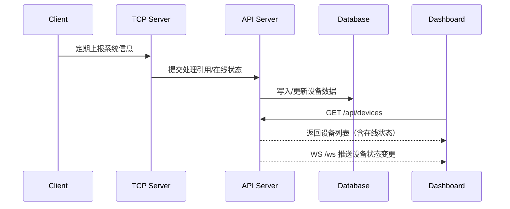
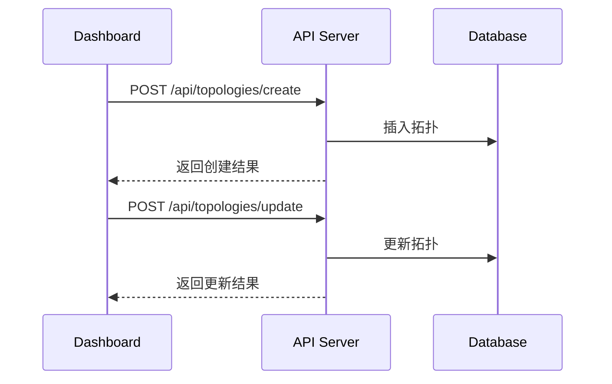

# Net Manager API 文档

## 概述

Net Manager 提供完整的设备、交换机、拓扑、性能监控等 RESTful API，并通过 WebSocket 推送实时数据。后端基于 Tornado 构建，端口与主机由配置决定，默认本地开发为 `http://localhost:8000`。

## 基础 URL

```
http://localhost:8000
```

## API端点

### 1. 主页与健康检查

- `GET /` 重定向至控制面板（构建后）
- `GET /health` 与 `GET /healthz` 返回健康状态

示例：
```json
{
  "status": "healthy",
  "service": "Net Manager API Server"
}
```

### 2. 健康检查

**请求URL**: `GET /health` 或 `GET /healthz`

**描述**: 检查API服务器的健康状态

**响应示例**:
```json
{
  "status": "healthy",
  "service": "Net Manager API Server"
}
```

### 2. 设备管理（Devices）

- `GET /api/devices` 获取设备列表（含在线状态与计数）
- `GET /api/devices/{device_id}` 获取设备详情
- `POST /api/devices/create` 创建设备
- `POST /api/devices/update` 更新设备
- `POST /api/devices/delete` 删除设备
- `PUT /api/devices/{device_id}/type` 更新设备类型

示例：
```json
{
  "status": "success",
  "data": [
    {
      "id": "device-123",
      "hostname": "DESKTOP-ABC",
      "ip_address": "192.168.1.100",
      "services_count": 15,
      "processes_count": 87,
      "online": true,
      "updated_at": "2025-12-06T10:00:00Z"
    }
  ],
  "count": 1
}
```

类型更新请求体：
```json
{
  "type": "server"
}
```

设备详情示例：
```json
{
  "status": "success",
  "data": {
    "id": "device-123",
    "hostname": "DESKTOP-ABC",
    "ip_address": "192.168.1.100",
    "services": [],
    "processes": [],
    "online": true,
    "updated_at": "2025-12-06T10:00:00Z"
  }
}
```

错误示例：
```json
{
  "status": "error",
  "message": "device not found"
}
```

### 3. 交换机管理（Switches & SNMP）

- `GET /api/switches` 列表
- `GET /api/switches/{id}` 详情
- `POST /api/switches/create` 创建
- `POST /api/switches/update` 更新
- `POST /api/switches/delete` 删除
- `POST /api/switches/scan` 进行 SNMP 扫描（完整）
- `POST /api/switches/scan/simple` 简化 SNMP 扫描

扫描请求示例：
```json
{
  "ip": "192.168.1.1",
  "snmp_version": "v3",
  "user": "managev3user",
  "auth_protocol": "sha",
  "auth_key": "***",
  "priv_protocol": "aes128",
  "priv_key": "***"
}
```

### 4. 拓扑管理（Topologies）

- `GET /api/topologies` 列表
- `GET /api/topologies/latest` 获取最新
- `GET /api/topologies/{topology_id}` 详情
- `POST /api/topologies/create` 创建
- `POST /api/topologies/update` 更新
- `POST /api/topologies/delete` 删除

创建/更新请求示例：
```json
{
  "name": "Office Network",
  "nodes": [{"id": "n1", "type": "Router"}],
  "edges": [{"source": "n1", "target": "n2"}],
  "groups": [{"id": "g1", "label": "Floor1"}]
}
```

### 5. 性能监控（Performance）

- `GET /api/performance` 返回服务器 CPU、内存、磁盘、网络指标

示例：
```json
{
  "cpu": {"cores": 8, "usage": [12.3, 10.1, 7.5, 3.2]},
  "memory": {"total": 16384, "used": 8123},
  "disk": [{"name": "C:", "total": 512000, "used": 301234}],
  "net": [{"iface": "eth0", "rx": 10234, "tx": 8234}]
}
```

### 6. WebSocket 实时推送

- `WS /ws` 建立连接后，服务端推送设备状态、性能数据更新

浏览器示例：
```javascript
const ws = new WebSocket('ws://localhost:8000/ws')
ws.onmessage = (e) => {
  const msg = JSON.parse(e.data)
  // 处理设备或性能更新
}
```

## 数据结构说明

### 系统信息(System Info) - 概要信息

| 字段名 | 类型 | 描述 |
|--------|------|------|
| mac_address | string | 客户端MAC地址 |
| hostname | string | 客户端主机名 |
| ip_address | string | 客户端IP地址 |
| services_count | integer | 客户端运行的服务数量 |
| processes_count | integer | 客户端运行的进程数量 |
| online | boolean | 客户端在线状态 |
| timestamp | string | 信息收集时间 |

### 系统信息(System Info) - 详细信息

| 字段名 | 类型 | 描述 |
|--------|------|------|
| mac_address | string | 客户端MAC地址 |
| hostname | string | 客户端主机名 |
| ip_address | string | 客户端IP地址 |
| services | array | 客户端运行的服务列表 |
| processes | array | 客户端运行的进程列表 |
| online | boolean | 客户端在线状态 |
| timestamp | string | 信息收集时间 |

### 服务信息(Service)

| 字段名 | 类型 | 描述 |
|--------|------|------|
| name | string | 服务名称 |
| status | string | 服务状态 |
| pid | integer | 进程ID |

### 进程信息(Process)

| 字段名 | 类型 | 描述 |
|--------|------|------|
| name | string | 进程名称 |
| status | string | 进程状态 |
| pid | integer | 进程ID |
| cpu_percent | float | CPU使用率 |
| memory_percent | float | 内存使用率 |

## 错误处理

API使用标准HTTP状态码来表示请求结果：

- `200` - 请求成功
- `404` - 请求的资源未找到
- `500` - 服务器内部错误

## 使用示例

### 使用curl

```bash
# 获取设备列表
curl http://localhost:8000/api/devices

# 获取设备详情
curl http://localhost:8000/api/devices/device-123

# 创建拓扑
curl -X POST http://localhost:8000/api/topologies/create \
  -H "Content-Type: application/json" \
  -d '{"name":"Office","nodes":[],"edges":[],"groups":[]}'
```

### 使用Python requests

```python
import requests

BASE = 'http://localhost:8000'

# 设备列表
resp = requests.get(f'{BASE}/api/devices')
devices = resp.json()['data']

# 更新设备类型
requests.put(f'{BASE}/api/devices/device-123/type', json={"type": "server"})

# 创建拓扑
topo = {"name": "Office", "nodes": [], "edges": [], "groups": []}
requests.post(f'{BASE}/api/topologies/create', json=topo)
```

## 交互序列图

客户端上报与控制面板展示：



拓扑编辑与保存：


